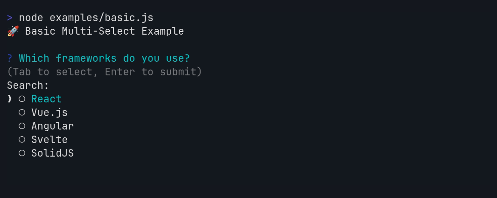

# inquirerjs-checkbox-search

A multi-select prompt with text filtering/search capability for [inquirer.js](https://github.com/SBoudrias/Inquirer.js).



This prompt combines the functionality of `@inquirer/checkbox` and `@inquirer/search`, allowing you to:

- ✅ **Multi-select** multiple options with checkboxes
- 🔍 **Search/filter** options in real-time as you type
- ⌨️ **Navigate** with arrow keys through filtered results

## Installation

- **npm**: `npm install inquirerjs-checkbox-search`
- **yarn**: `yarn add inquirerjs-checkbox-search`
- **pnpm**: `pnpm add inquirerjs-checkbox-search`

## Usage

### Quick Start

```typescript
import checkboxSearch from 'inquirerjs-checkbox-search';

const selected = await checkboxSearch({
  message: 'Which frameworks do you use?',
  choices: [
    { value: 'react', name: 'React' },
    { value: 'vue', name: 'Vue.js' },
    { value: 'angular', name: 'Angular' },
  ],
});

console.log('Selected:', selected);
// => ['react', 'vue']
```

## API

### Options

| Property       | Type                                                                                | Required | Description                                                                                                                                                              |
| -------------- | ----------------------------------------------------------------------------------- | -------- | ------------------------------------------------------------------------------------------------------------------------------------------------------------------------ |
| `message`      | `string`                                                                            | Yes      | The question to ask                                                                                                                                                      |
| `choices`      | `Array<Choice \| string \| Separator>`                                              | No\*     | Static list of choices                                                                                                                                                   |
| `source`       | `(term?: string, opt: { signal: AbortSignal }) => Promise<Array<Choice \| string>>` | No\*     | Async function for dynamic choices                                                                                                                                       |
| `pageSize`     | `number \| PageSizeConfig`                                                          | No       | Page size configuration. Can be a number (fixed size) or PageSizeConfig object for advanced control. If not specified, auto-sizes based on terminal height (fallback: 7) |
| `loop`         | `boolean`                                                                           | No       | Whether to loop around when navigating (default: true)                                                                                                                   |
| `required`     | `boolean`                                                                           | No       | Require at least one selection (default: false)                                                                                                                          |
| `validate`     | `(selection: Array<Choice>) => boolean \| string \| Promise<string \| boolean>`     | No       | Custom validation function                                                                                                                                               |
| `instructions` | `string \| boolean`                                                                 | No       | Custom instructions text or false to hide                                                                                                                                |
| `theme`        | `Theme`                                                                             | No       | Custom theme configuration                                                                                                                                               |
| `default`      | `Array<Value>`                                                                      | No       | Initially selected values                                                                                                                                                |
| `filter`       | `(items: Array<Choice>, term: string) => Array<Choice>`                             | No       | Custom filter function                                                                                                                                                   |

\*Either `choices` or `source` must be provided.

### Choice Object

```typescript
type Choice<Value = any> = {
  value: Value; // The value returned when selected
  name?: string; // Display text (defaults to value)
  description?: string; // Additional description shown below
  short?: string; // Shorter text for final answer
  disabled?: boolean | string; // Whether choice is selectable
  checked?: boolean; // Initially selected
};
```

### PageSize Configuration

The `pageSize` property accepts either a number (for simple fixed sizing) or a `PageSizeConfig` object for advanced control:

```typescript
type PageSizeConfig = {
  base?: number; // Starting page size (if not specified, auto-calculated from terminal)
  max?: number; // Maximum page size (absolute constraint)
  min?: number; // Minimum page size (absolute constraint, defaults to 1)
  buffer?: number; // Fixed buffer lines to subtract from page size
  autoBufferDescriptions?: boolean; // Auto-reserve space for descriptions
  autoBufferCountsLineWidth?: boolean; // Consider terminal width when counting description lines
  minBuffer?: number; // Minimum buffer lines (applied after auto/manual buffer)
};
```

**Buffer Calculation Process:**

1. Start with base page size (from `base` or auto-calculated)
2. Calculate buffer:
   - If `autoBufferDescriptions` is true: Add lines needed for largest description
   - Otherwise: Add `buffer` value (if specified)
   - Ensure buffer is at least `minBuffer` (if specified)
3. Subtract buffer from base page size
4. Apply `min`/`max` constraints
5. Ensure final result is at least 1

### Theme Options

```typescript
type CheckboxSearchTheme = {
  icon: {
    checked: string | ((text: string) => string);
    unchecked: string | ((text: string) => string);
    cursor: string | ((text: string) => string);
  };
  style: {
    answer: (text: string) => string;
    message: (text: string) => string;
    error: (text: string) => string;
    help: (text: string) => string;
    highlight: (text: string) => string;
    searchTerm: (text: string) => string;
    description: (text: string) => string;
    disabled: (text: string) => string;
  };
  helpMode: 'always' | 'never' | 'auto';
};
```

## Keyboard Controls

| Key                       | Action                             |
| ------------------------- | ---------------------------------- |
| <kbd>Type</kbd>           | Filter/search options              |
| <kbd>↑</kbd>/<kbd>↓</kbd> | Navigate through options           |
| <kbd>Tab</kbd>            | Toggle selection of current option |
| <kbd>Escape</kbd>         | Clear search filter                |
| <kbd>Enter</kbd>          | Confirm selection                  |

## Advanced Features

For detailed examples of advanced features, see the [`examples/`](./examples/) directory.

Each example includes detailed comments and demonstrates real-world usage patterns.

## Developer Guide

This section covers the tools and workflows used in this project for contributors and maintainers.

### Tools Overview

#### Build System

- **[tshy](https://github.com/isaacs/tshy)** - Modern TypeScript build tool that generates both ESM and CommonJS outputs
  - Configuration in `package.json` under `tshy` field
  - Builds to `dist/esm/` and `dist/commonjs/`
  - Automatically handles dual exports

#### Package Management

- **npm** - Package manager (npm 9+ required)
- **Node.js 18+** - Runtime requirement
- **package.json** - Standard npm configuration with dual exports

#### Code Quality

- **[ESLint](https://eslint.org/)** - Linting with TypeScript support
  - Configuration: `eslint.config.js`
  - Rules: TypeScript ESLint recommended + Prettier integration
- **[Prettier](https://prettier.io/)** - Code formatting
  - Configuration: `.prettierrc`
- **[TypeScript](https://www.typescriptlang.org/)** - Type checking and compilation
  - Configuration: `tsconfig.json`, `tsconfig.test.json`

#### Testing

- **[Vitest](https://vitest.dev/)** - Fast testing framework
  - Configuration: `vitest.config.ts`
  - Features: TypeScript support, coverage, UI mode, watch mode
- **[@inquirer/testing](https://www.npmjs.com/package/@inquirer/testing)** - Testing utilities for inquirer prompts
- **[@vitest/coverage-v8](https://www.npmjs.com/package/@vitest/coverage-v8)** - Coverage reporting

#### Development Tools

- **[@arethetypeswrong/cli](https://github.com/arethetypeswrong/arethetypeswrong.github.io)** - Package validation for dual exports
- **[rimraf](https://github.com/isaacs/rimraf)** - Cross-platform file deletion

### Development Workflows

#### Setup & Installation

```bash
# Clone and install
git clone https://github.com/texarkanine/inquirerjs-checkbox-search.git
cd inquirerjs-checkbox-search
npm install
```

#### Development Commands

```bash
# Development (watch mode)
npm run dev                # Build in watch mode with tshy

# Building
npm run build             # Build for production
npm run clean             # Clean build artifacts

# Code Quality
npm run lint              # Run ESLint (with --fix)
npm run format            # Format code with Prettier
npm run typecheck         # TypeScript type checking

# Testing
npm test                  # Run all code quality checks + tests
npm run test:unit         # Run unit tests only
npm run test:coverage     # Run tests with coverage report
npm run test:ui           # Run tests with Vitest UI
npm run test:unit -- --watch   # Run tests in watch mode

# Package Validation
npm run attw              # Validate package exports with arethetypeswrong

# Pre-publish
npm run prepublishOnly    # Full build + test + validation pipeline
```

#### File Structure

```
├── src/
│   ├── index.ts          # Main prompt implementation
│   └── *.test.ts         # Test files (excluded from build)
├── dist/                 # Built output (generated by tshy)
│   ├── esm/             # ES modules
│   └── commonjs/        # CommonJS
├── .github/
│   └── workflows/       # CI/CD workflows
├── node_modules/        # Dependencies
├── package.json         # Package config with tshy setup
├── tsconfig.json        # TypeScript config
├── vitest.config.ts     # Test config
├── eslint.config.js     # Linting config
└── .prettierrc          # Formatting config
```

#### Demo Generation

Demo GIFs are automatically generated in CI for PRs and releases: The [vhs](https://github.com/charmbracelet/vhs) tool is used to record the [examples](./examples/) and save them to GIFs in [`docs/img/`](./docs/img/)

To generate demos locally, run `npm run demo:generate:all` (requires `docker`).

#### Quality Assurance Workflow

1. **Before Committing**

   ```bash
   npm test                  # Run all quality checks + tests
   ```

2. **Before Publishing**
   ```bash
   npm run prepublishOnly    # Full validation pipeline
   ```

#### Build & Release Workflow

1. **Development Build**

   ```bash
   npm run build             # One-time build
   npm run dev               # Watch mode for development
   ```

2. **Package Validation**

   ```bash
   npm run attw              # Validate dual exports work correctly
   ```

3. **Release Process** (Automated)
   - Push changes to `main` branch
   - Release Please creates/updates release PR
   - Merge release PR to trigger:
     - GitHub release creation
     - npm package publication
     - Version tag creation

## Contributing

See [CONTRIBUTING.md](CONTRIBUTING.md) for development setup and contribution guidelines.
