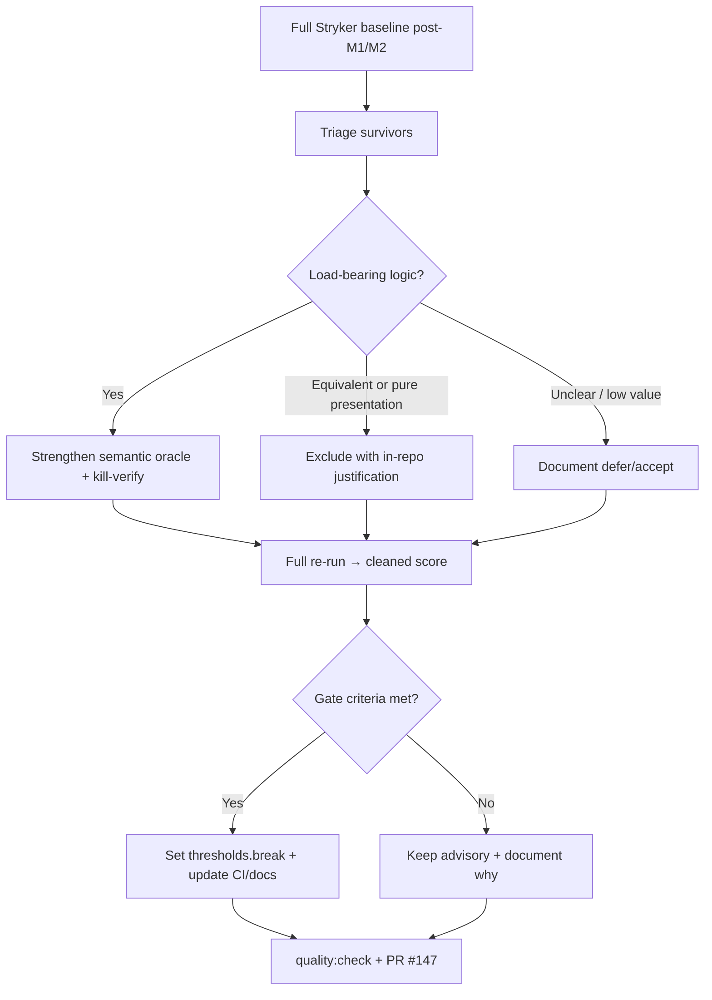

# Task: issue-147-max-test-qa / M3-mutation-hardening

* Task ID: issue-147-m3-mutation-hardening
* Complexity: Level 3
* Type: enhancement (test quality / mutation tooling)

Kill load-bearing Stryker survivors with stronger semantic oracles, cut justified junk from the mutation denominator (`mutator.excludedMutations` / targeted `// Stryker disable`), re-baseline the score after M1/M2 suite changes, and decide whether CI should keep mutation advisory or set `thresholds.break` near the cleaned floor. One PR to `main` referencing `[#147]`. No product-behavior changes unless a new test reveals a genuine defect (then TDD + `fix:`).

## Pinned Info

### Survivor triage → kill / exclude / gate

Shows the ordered M3 pipeline and where the CI-gating decision sits (after cleaned score, not before).

## Component Analysis

### Affected Components
- **Test suite (`src/__tests__/*.test.ts`)**: behavior-sliced Vitest/`@inquirer/testing` suites → strengthen oracles that kill load-bearing survivors; place cases by behavior (`search-filtering`, `selection`, `page-sizing`/`pagesize-config`, `basic-functionality`/`compatibility`, `navigation`, etc.); never invent presentation-coupled pins
- **`stryker.config.json`**: mutation harness config → add justified `mutator.excludedMutations` (and optionally `thresholds.break`); keep incremental/reporting behavior unless gating requires comment/job updates
- **`.github/workflows/pr.yaml` (`mutation` job)**: advisory mutation CI → if gating: set break + rename/comments; if not: leave advisory with updated rationale comments if needed
- **Docs (`memory-bank/techContext.md`, `CONTRIBUTING.md`)**: document advisory-vs-gate truth → surgical updates only if M3 changes the CI contract
- **`src/index.ts`**: prompt implementation → **no edits by default**; only (a) TDD'd `fix:` if a test reveals a defect, or (b) narrowly scoped `// Stryker disable` with justification for site-specific equivalents that cannot be expressed as mutator excludes

### Cross-Module Dependencies
- Tests → `src/index.ts`: tests are the kill mechanism; production code is the mutate target
- `stryker.config.json` → suite + `src/index.ts`: mutate globs and excludes shape the denominator; score is meaningless if excludes are unjustified
- PR workflow → `stryker.config.json` + `npm run test:mutate`: CI reads config; `thresholds.break` is the gate lever (null = advisory)
- Docs → CI/config: `techContext.md` / `CONTRIBUTING.md` must match whatever gate decision lands

### Boundary Changes
- **Public library API**: none intended
- **CI contract**: possible change from “Mutation (advisory)” (score never fails) to score-gated failure via `thresholds.break` — must be explicit in workflow comments + docs
- **Mutation denominator**: shrinks only via justified excludes/disables (invariant 4)

### Invariants & Constraints
1. No product behavior changes unless a genuine defect is found (then TDD + `fix:`)
2. SLOBAC bar remains: no vacuous assertions, no presentation-coupled oracles (theme-injection / answer-array patterns only)
3. Selection-across-filter invariant stays guarded
4. Every `excludedMutations` entry and `// Stryker disable` has an in-repo reason (equivalent or pure presentation)
5. Every strengthened test is kill-verified with a fresh `--incrementalFile` range run
6. `npm run quality:check` green; `npm run format` before push
7. One PR referencing `[#147]`, after M2 merge (already done: #158)
8. Unreachable branches stay out-of-surface with recorded reason — do not fake coverage/kills
9. Spurious 100% via label/theme/empty-string pins is a failed milestone

## Open Questions

None — implementation approach is clear from issue #147, L4 milestone scope, and the #145 archive decision notes. The CI `thresholds.break` choice is a **late go/no-go with fixed criteria** (see Implementation Plan step 7), not an up-front design fork requiring creative exploration.

## Test Plan (TDD)

### Behaviors to Verify

Pre-identified hit-list from milestones / #145 (exact line ranges come from the post-M1/M2 baseline triage — do not hard-code stale #145 lines):

- **B1 empty-filter short-circuit**: filter that yields zero matches → navigation/selection behavior matches “no rows” contract; mutants that break the short-circuit die
- **B2 default `checked` / `loop` / `validate`**: omitting those options → same observable behavior as documented defaults; default-literal mutants die via semantic outcome, not string pins
- **B3 `default` values application**: choices with `default`/pre-checked config → submit answer includes them without extra toggles
- **B4 `PageSizeConfig` boundaries**: min/max/autoBuffer edges → page size / scroll window respects bounds; boundary mutants die
- **B5 `renderItem` checked/disabled branches (load-bearing only)**: checked vs unchecked and disabled vs enabled remain distinguishable via theme-injection or answer/behavior oracles — not raw ANSI/default glyphs
- **B6 justified excludes**: each excluded mutant category/site has a recorded reason; unjustified excludes are forbidden
- **B7 CI gate decision**: after cleaned score, either (a) `thresholds.break` set near floor and job fails below it, or (b) advisory retained with documented reason
- **B8 selection-across-filter**: existing guard still asserts answer-array identity across filter changes
- **B9 green boundary**: full suite + `quality:check` pass

### Edge Cases
- Survivor looks load-bearing but only flips presentation → exclude with reason, do not pin copy
- Kill attempt requires product bug → TDD fix as `fix:`, call out in progress
- Range kill-verify polluted by shared incremental file → always fresh nonexistent `--incrementalFile`
- Full-run wall time / CI timeout (30m) → do not lower timeout to chase green; only change timeout with evidence

### Test Infrastructure
- Framework: Vitest + `@inquirer/testing`
- Location: `src/__tests__/*.test.ts` (behavior-sliced)
- Conventions: answer-array oracles first; theme-injection for styling; `expectAnswerPending` for pending; no B*/Feature fossils
- Kill-verify: `npx stryker run --mutate "src/index.ts:<start>-<end>" --reporters clear-text --incrementalFile /tmp/stryker-range.json`
- New test files: none expected — extend existing suites

### Integration Tests
- Full `npm run test:mutate` after kill+exclude wave (suite × mutator × config)
- PR workflow mutation job still completes (advisory or gated) — verified by config/docs consistency; live CI on the PR

## Implementation Plan

1. **Branch + workspace**
    - Files: git branch `mutate-me-up` from the current L4 working tip (the commits that carry this plan ahead of `origin/main`), not a clean `main` checkout that drops memory-bank
    - Changes: feature branch for M3-only commits; memory-bank updates travel with the work

2. **Baseline mutation run (post-M1/M2)**
    - Files: `reports/` (local/CI cache), progress notes
    - Changes: run `npm run test:mutate` (or equivalent); capture total/covered scores and survivor list; replace #145 numbers as working baseline

3. **Triage table**
    - Files: `memory-bank/active/progress.md` (and optionally a short checklist subsection in this file)
    - Changes: classify each high-value survivor → Kill / Exclude / Defer; seed with empty-filter, defaults, PageSizeConfig, renderItem checked/disabled; add any new load-bearing survivors the baseline surfaces

4. **Kill wave (TDD per target)** — repeat per Kill row
    - Files: appropriate `src/__tests__/<behavior>.test.ts`
    - Changes: stub → implement stronger semantic oracle → green suite → kill-verify range → mark triage row done
    - TDD amendment (same as M1/M2): production code already correct → stub→implement→green→kill-verify substitutes for red-first

5. **Exclude wave**
    - Files: `stryker.config.json`; optionally narrow `// Stryker disable` in `src/index.ts`; durable ledger in `CONTRIBUTING.md` (or a short subsection under Testing) listing each exclude/disable with equivalent-vs-presentation reason
    - Changes: add `mutator.excludedMutations` and/or site disables **only** with that ledger entry (JSON has no comments — the ledger is the in-repo justification). Prefer config-level excludes for operator categories; disable comments for site-specific cases

6. **Cleaned full re-run**
    - Files: progress notes
    - Changes: full `npm run test:mutate`; record cleaned score and remaining survivors; confirm kill-set grew and excludes are accounted for

7. **CI gating go/no-go** (criteria — apply after step 6)
    - **Set `thresholds.break`** only if all hold: (a) load-bearing hit-list kills done or explicitly deferred with reason; (b) remaining denominator noise is justified-excluded or accepted as contract; (c) cleaned score is stable enough to pick a modest floor **below** the cleaned score (not aspirational 100%); (d) false-red risk from flaky/hang mutants is low given current timeout/incremental setup
    - **Keep advisory** if presentation/equivalent long-tail still dominates without honest excludes, or cleaned score is too volatile to gate
    - Files if gating: `stryker.config.json` (`thresholds.break`), `.github/workflows/pr.yaml` (job name/comments), `techContext.md`, `CONTRIBUTING.md`
    - Files if advisory: progress + brief comment/doc note that M3 reaffirmed advisory and why

8. **Docs sync**
    - Files: `memory-bank/techContext.md`, `CONTRIBUTING.md` (gate contract if step 7 changed it; exclusion ledger from step 5 always if any excludes landed)
    - Changes: surgical truth updates — advisory vs gated; keep exclusion ledger aligned with `stryker.config.json`

9. **Boundary verification + PR**
    - Run `npm run format` then `npm run quality:check` and full `npm test`
    - Open draft PR titled with conventional type + `[#147]`; merge before L4 advances past M3

## Technology Validation

No new technology — validation not required. M3 uses existing StrykerJS + Vitest runner already in-repo from #145.

## Challenges & Mitigations

- **Stale #145 survivor lines after M1/M2**: always re-baseline (step 2) before kill work; treat milestone hit-list as seeds, not coordinates
- **Presentation mutants tempting copy pins**: refuse; exclude with reason or use theme-injection; invariant 3 / issue non-goals
- **Incremental cache polluting range scores**: fresh nonexistent `--incrementalFile` every kill-verify
- **Full mutate runtime (~8–15m CI / longer local)**: use range runs in the inner loop; one full run at baseline and one after exclude wave
- **Pressure to set `thresholds.break` for a vanity number**: criteria in step 7; keeping advisory is a valid M3 completion if documented
- **Accidental product edits**: diff-discipline — test/config/docs only unless defect proven

## Pre-Mortem

- **Gated CI on a noisy score → chronic false reds**: already covered by Challenge (vanity gate) + step 7 criteria requiring modest floor and low false-red risk — prefer advisory over a brittle break
- **“100% by exclusion” without kill-power**: strengthen invariant 4 check in preflight/QA — every exclude must name equivalent-vs-presentation; score alone is not acceptance
- **Skipping baseline and hunting #145 line numbers**: step 2 is mandatory; preflight should fail the plan if build starts from stale coordinates
- **Weakening selection-across-filter while consolidating kills**: B8 + cross-milestone invariant 5 — QA explicitly re-checks that guard

## Preflight Amendments

- Branch from L4 working tip (plan commits), not bare `main`
- Exclusion justifications live in a durable `CONTRIBUTING.md` ledger (JSON cannot hold comments)
- Kill-wave TDD confirmed: stub → implement oracle → green → kill-verify; any `src/index.ts` defect fix is a separate TDD `fix:` cycle

## Build Progress

- [x] 1. Branch `mutate-me-up` from L4 tip
- [x] 2. Baseline mutation run (82.07% / 105 survived / 4 no-cov)
- [x] 3. Triage table recorded in progress.md
- [x] 4. Kill wave (TDD + kill-verify per target)
- [x] 5. Exclude wave + CONTRIBUTING ledger
- [x] 6. Cleaned full re-run (88.14% / 58 survived / 102 ignored)
- [x] 7. CI gating go/no-go → set `thresholds.break: 80`
- [x] 8. Docs sync (CONTRIBUTING ledger, techContext, pr.yaml)
- [x] 9. Boundary verification (`format` + `quality:check` + 133 tests)

## Status

- [x] Component analysis complete
- [x] Open questions resolved
- [x] Test planning complete (TDD)
- [x] Implementation plan complete
- [x] Technology validation complete
- [x] Pre-Mortem complete
- [x] Preflight
- [x] Build
- [x] QA
