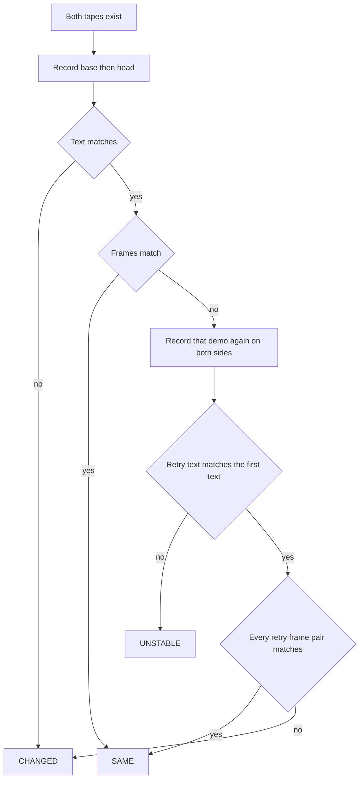

# Task: issue-190

* Task ID: issue-190
* Complexity: Level 3
* Type: feature

Demo pull-request comments expand every demo because GIF bytes are compared, and VHS never writes the same GIF twice. This build records the merge-base and the pull-request head in one job, fingerprints each demo from the text record and the frame-text PNG sequence, and reports those verdicts in shadow. Today's expand/collapse and today's release-please GIF amend stay as they are until real pull requests show that a dependency bump comes out SAME.

## Pinned Info

### Frame verdict

A text mismatch is final. A frame mismatch counts only when the re-recording still disagrees. One agreeing pair does not cancel a retry that still disagrees.

```mermaid
flowchart TD
  both[Both tapes exist]
  record[Record base then head]
  textMatch{Text matches}
  changed[CHANGED]
  frameMatch{Frames match}
  same[SAME]
  retry[Record that demo again on both sides]
  stable{Retry text matches the first text}
  unstable[UNSTABLE]
  retryMatch{Every retry frame pair matches}
  both --> record
  record --> textMatch
  textMatch -->|no| changed
  textMatch -->|yes| frameMatch
  frameMatch -->|yes| same
  frameMatch -->|no| retry
  retry --> stable
  stable -->|no| unstable
  stable -->|yes| retryMatch
  retryMatch -->|yes| same
  retryMatch -->|no| changed
```

## Component Analysis

### Affected Components

- `scripts/demo-fingerprint.ts` (new): pure fingerprint and verdict logic, plus the scratch reader and CLI. No such module exists today. Node 22.22 runs it directly (type stripping is on by default in this environment). No enums and no parameter properties. Local imports use a `.ts` suffix.
- `scripts/demo-fingerprint.test.ts` (new): Vitest coverage for that module.
- `scripts/generate-demo.js`: builds one image tagged `vhs-node-demo` and runs tapes with `--output` pointed at `docs/img`. Gains flags and imports `./demo-fingerprint.ts` for the tape rewrite and the docker argv. The process that runs is always this file from the workflow checkout, never the copy inside a base worktree.
- `tsconfig.scripts.json` (new): `noEmit`, `rootDir` overridden off `./src`, `allowImportingTsExtensions`, `include` of `scripts/**/*.ts`. `npm run typecheck` runs `tsc --noEmit` and `tsc --noEmit -p tsconfig.scripts.json`. ESLint's `parserOptions.project` gains this file. `tsconfig.test.json` stays `src` tests only, so it does not inherit a `rootDir` conflict (TS6059).
- `demos/*.tape` on this branch: after `Enter` on `node examples/….js`, each tape sleeps 1s while hidden. That sleep becomes `Wait+Screen /Search:/`. The rendered prompt prefix is `Search:` (`src/index.ts`). Tapes at the merge-base keep `Sleep 1s` until this lands. Shadow tolerates that: this pull request's own verdicts compare different preambles, and comparable verdicts start once the merge-base contains the wait.
- `.github/workflows/generate-demos.yaml`: today's GIF generation, upload, GIF diff, and release-please amend stay on the checkout, which for `pull_request` is the synthetic merge commit. Shadow recordings are additional. They do not write `docs/img`.
- `.github/workflows/scripts/detect-demo-changes.sh`: git-diffs `docs/img/*-demo.gif`. Stays the source of today's expand/collapse and of the release-please amend decision.
- `.github/workflows/scripts/templates/demo-comment.md`: gains one shadow-verdict line. The `
` blocks stay driven by the GIF diff.
- `vitest.config.ts`: `include` adds `scripts/**/*.test.ts`. Coverage `include` stays `src/**/*.ts`. Stryker mutate stays `src/**/*.ts`.

### Cross-Module Dependencies

- The workflow checkout's `generate-demo.js` records both sides. For the base side, `--demos-dir` and `--build-context` point at the merge-base worktree. For the shadow head side, they point at a worktree of `pull_request.head.sha`. The script inside either worktree is not executed.
- `generate-demo.js` calls `withFingerprintOutputs` and `buildDockerRunArgs` from `scripts/demo-fingerprint.ts`, then `docker build` and `docker run`.
- The workflow then runs `node scripts/demo-fingerprint.ts` on the scratch tree. That CLI prints one assessment per demo.
- The comment template reads `SHADOW_VERDICTS` from the workflow. It does not import the module.
- Each side's image is built from that worktree's `demos/Dockerfile` (`FROM ghcr.io/charmbracelet/vhs:v0.10`). Tags are `vhs-node-demo:base` and `vhs-node-demo:head`.
- Worktrees and scratch live under `$RUNNER_TEMP`, outside the repo. `.dockerignore` does not exclude them, and the Dockerfile `COPY . .` would otherwise bake them into the checkout's image.
- Recordings of the two sides run one after the other, and demos inside a side run one at a time.

### Boundary Changes

- No package export or published file changes. `npm run demo:generate*` without the new flags still writes only the GIF, from the checkout, with `--output`.
- `docs/img` continues to be produced by today's generate step on the checkout (the merge commit). Shadow gifs stay in scratch. The GIF diff and the release-please amend therefore compare the same bytes they compare today.
- The pull-request comment gains one shadow line. Which `
` blocks are open does not change.
- `npm run typecheck` also typechecks `scripts/**/*.ts`.

### Invariants and Constraints

- Feature pull requests get no bot commits.
- Frame hashes are never committed and never uploaded. Scratch stays off `docs/img/*.gif`.
- A text mismatch is CHANGED on the first comparison.
- A frame mismatch is CHANGED when a retry pair also mismatches. SAME when the first frames differ and every retry pair matches.
- A retry whose text differs from the first recording of that same side is UNSTABLE. Shadow prints it and exits 0, so the required check stays green.
- The shadow head tree is a worktree of `pull_request.head.sha`. The shadow base tree is a worktree of `git merge-base` of that SHA and the PR base. The checkout itself stays the merge commit and stays the only writer of `docs/img`.
- A pull request that changes `demos/Dockerfile` or the VHS version is CHANGED when that change shows up in the text record or the frame-text pixels. A change that leaves both alone, such as a comment in the Dockerfile, is SAME. There is no path-based short-circuit.
- Durations are not compared.
- This build does not switch the comment and does not gate release-please GIF commits on the new verdict. Those wait until shadow shows dependency bumps as SAME. The verdict vocabulary is the contract that follow-up consumes.

## Open Questions

None. The issue specifies the fingerprints, the same-job recording, and shadow mode. The operator's retry amendment on 2026-10-08 replaces the issue's "SAME if any pair matches" rule. The comment switch is sequenced after shadow by the issue's rollout, and this session cannot produce the week of pull requests that rollout asks for.

## Test Plan (TDD)

### Behaviors to Verify

- Text record with setup frames that are only `>` or whitespace, then repeated screens → those setup frames are dropped and consecutive duplicates collapse to one.
- Two different validation lines → normalized text differs.
- Same screens written with a different number of held duplicates → normalized text matches.
- Frame paths in filename order, with consecutive identical PNG bytes → fingerprint hashes each file, keeps 16 hex chars, collapses consecutive repeats, then hashes that sequence.
- Same frames with a different run of duplicates → same fingerprint.
- One PNG byte different → different fingerprint.
- Empty frame list → a defined fingerprint, equal to another empty list.
- Tape only on the head → NEW. Tape only on the base → REMOVED.
- Both tapes, text differs on the first attempt → CHANGED, and a later frame match does not override it.
- Both tapes, text matches, frames match → SAME. No retry signal.
- Both tapes, text matches, frames differ, no retry supplied → NEED_FRAME_RETRY.
- Retry text on one side differs from that side's first text → UNSTABLE.
- First frames differ, the only retry's frames match, retry text matches the first text → SAME.
- First frames differ, a retry's frames also differ → CHANGED.
- Two retries, the first retry matches and the second differs → CHANGED.
- Temporary tape copy → original bytes untouched; appended `Output` lines use quoted container paths; the frames path ends in `/`.
- Docker argv when scratch is set → image tag, scratch mount at `/workspace/scratch`, in-container tape path, and no `--output` flag. The gif is an `Output` line in the tape, so the CLI flag cannot replace or duplicate the tape outputs. The non-scratch path is not reconstructed and is not tested: it stays the existing `npm run demo:docker:run` invocation.
- `parseGenerateArgs`, exported from `scripts/demo-fingerprint.ts` → `--image`, `--scratch`, `--demos-dir`, and `--build-context` round-trip. Unknown flags fail.
- Scratch reader given `frame-text-*.png` and `frame-cursor-*.png` → the fingerprint is built only from `frame-text-*.png`, in filename order.
- Scratch reader given a missing `record.txt`, a missing `frames/` directory, or a `frames/` directory with no `frame-text-*.png` → throws.
- A demo name that is not `^[a-zA-Z0-9_-]+$` → throws.
- `assessScratch` on attempt-0 only, with matching text and differing frames → prints `NEED_FRAME_RETRY` and the process exit helper returns 0.
- `assessScratch` including attempt-1 → applies the verdict rule and returns 0 for CHANGED, SAME, and UNSTABLE.
- `assessScratch` on a bad name or a missing recording → the exit helper returns 1.
- CLI stdout for basic SAME, validation NEED_FRAME_RETRY, and a NEW demo → sorted `<demo>: <ASSESSMENT>` lines, then one final line `SHADOW_VERDICTS=` plus the shadow sentence. The workflow can split retry names on the assessment field and can take the shadow sentence from that final line.

### Edge Cases

- Text record that is empty after normalization matches another empty record.
- A frames path passed to `withFingerprintOutputs` without a trailing slash is stored with one.
- `Wait+Screen /Search:/` replaces only the hidden sleep after `node examples/….js`. The later `Sleep` lines stay. Merge-base tapes still contain that sleep until this change is on `main`.

### Test Infrastructure

- Framework: Vitest, `npm test` and `npx vitest run -t "TEST_NAME"`.
- Test location: `scripts/demo-fingerprint.test.ts`.
- Conventions: behavior names, `src/**/*.test.ts` today. This file is the first test outside `src/`.
- New test files: `scripts/demo-fingerprint.test.ts`.
- `vitest.config.ts` `include` adds `scripts/**/*.test.ts`. Coverage `include` stays `src/**/*.ts`.
- `tsconfig.scripts.json` includes the module and its test. `npm run typecheck` runs it. ESLint's project list includes it. `tsconfig.test.json` is unchanged.
- No test infrastructure exists for bash or for GitHub Actions. The workflow step is glue over the tested CLI. No new runner.

### Integration Tests

- None in Vitest. Docker is not installed on this machine, and a tape-content assertion would go red only when the tape is edited. The workflow's shadow line on a real pull request is the integration observation.

## Implementation Plan

### 1. Text normalization — executable

- Files: `scripts/demo-fingerprint.ts`, `scripts/demo-fingerprint.test.ts`, `vitest.config.ts`, `tsconfig.scripts.json`, `package.json`, `eslint.config.js`

1. Stub tests: empty cases for dropping bare-prompt frames, collapsing consecutive screens, and keeping a one-character text change.
2. Stub interface: `normalizeTextRecord(text: string): string`. The file uses erasable TypeScript only: no enums, no parameter properties. Imports of local TypeScript use a `.ts` suffix.
3. Write tests and run red: the issue's separator is `─` repeated 80 times; drop frames matching `/^[>\s]*$/`; collapse consecutive identical frames; join the kept frames with that separator.
4. Write code and run green: implement that function. Add `tsconfig.scripts.json` with `noEmit`, `allowImportingTsExtensions`, `rootDir` set to the repo root, and `include` of `scripts/**/*.ts`. Point `npm run typecheck` at it as a second `tsc --noEmit -p`. Add it to ESLint `parserOptions.project`. Register the test with Vitest. Do not add `scripts/` to `tsconfig.test.json`.

### 2. Frame-state fingerprint — executable

- Files: `scripts/demo-fingerprint.ts`, `scripts/demo-fingerprint.test.ts`

1. Stub tests: empty cases for duplicate collapse, byte sensitivity, and the empty list.
2. Stub interface: `frameStateFingerprint(framePaths: readonly string[]): string`.
3. Write tests and run red: paths are hashed in the given order with SHA-256, truncated to 16 hex chars, consecutive repeats removed, then the remaining lines hashed. Tests write tiny distinct files in a temp directory.
4. Write code and run green: implement with `node:crypto`. No new dependency.

### 3. Verdict — executable

- Files: `scripts/demo-fingerprint.ts`, `scripts/demo-fingerprint.test.ts`

1. Stub tests: empty cases for NEW, REMOVED, CHANGED, SAME, NEED_FRAME_RETRY, and UNSTABLE, including the two-retry case where a later mismatch wins.
2. Stub interface: `assessFingerprints(input: AssessmentInput): Assessment`. `Assessment` is `NEW`, `REMOVED`, `CHANGED`, `SAME`, `UNSTABLE`, or `NEED_FRAME_RETRY`. Input carries whether each tape exists and the attempts. Each attempt has normalized text and a frame fingerprint per side, or records that the side was not recorded.
3. Write tests and run red: assert the pinned flowchart, including "a matching retry does not erase a later differing retry" and "a text mismatch is not retried into SAME".
4. Write code and run green: implement `assessFingerprints`. Add `formatShadowLine(entries: { name: string, assessment: Assessment }[]): string` and test its single-line shape.

### 4. Tape output injection and docker argv — executable

- Files: `scripts/demo-fingerprint.ts`, `scripts/demo-fingerprint.test.ts`, `scripts/generate-demo.js`

1. Stub tests: empty cases for the temporary tape, for `buildDockerRunArgs`, and for `parseGenerateArgs`.
2. Stub interface: `withFingerprintOutputs(tapeSource: string, textPath: string, framesDir: string): string`, `buildDockerRunArgs(options): string[]`, and `parseGenerateArgs(argv: readonly string[]): GenerateArgs`, all exported from `scripts/demo-fingerprint.ts`.
3. Write tests and run red: the source string is unchanged; the result appends quoted `Output` lines for the gif, the text file, and the frames directory; the frames path ends in `/`; those paths are the container paths under `/workspace/scratch`. Args for a scratch run include the image, the host scratch mounted at `/workspace/scratch`, and the in-container tape path, and they omit `--output`. `parseGenerateArgs` accepts `--image`, `--scratch`, `--demos-dir`, and `--build-context`. Tests import these from the TypeScript module only. They do not import `generate-demo.js`.
4. Write code and run green: implement the helpers. `generate-demo.js` keeps today's `npm run demo:docker:*` path when the scratch flags are absent, and that path does not import the TypeScript module, so `engines` stays `>=22`. When a scratch flag is present, `main` dynamic-imports `./demo-fingerprint.ts` and uses `parseGenerateArgs`. Scratch mode, including a one-demo retry, creates the host demo directory and `frames/` before `docker run`, builds with `docker build -f <context>/demos/Dockerfile -t <image> <context>`, and runs `docker` through `execFileSync` with the argv array. It does not call `npm run demo:docker:build` or `demo:docker:run`.

### 5. Scratch CLI — executable

- Files: `scripts/demo-fingerprint.ts`, `scripts/demo-fingerprint.test.ts`

1. Stub tests: empty cases for frame-text selection, missing recordings, demo-name rejection, attempt layout, and exit codes.
2. Stub interface: `listFrameTextPngs(framesDir: string): string[]`, `readSide(demoDir: string): { text: string, frames: string }`, `assessScratch(options: { scratchRoot: string, baseTapesDir: string, headTapesDir: string }): { lines: string[], exitCode: number }`. Layout is `<scratchRoot>/attempt-<n>/{base,head}/<demo>/{record.txt,frames/}`. `main` parses argv and writes the lines to stdout.
3. Write tests and run red: only `frame-text-*.png` is hashed; `frame-cursor-*.png` is ignored; a missing text file, a missing frames directory, or a frames directory with no text frames throws; a demo name outside `^[a-zA-Z0-9_-]+$` throws; a first-attempt frame mismatch returns `NEED_FRAME_RETRY` with exit 0; a completed retry returns the flowchart verdict with exit 0, including UNSTABLE; a structural error returns exit 1. `formatCliStdout` for a SAME demo, a NEED_FRAME_RETRY demo, and a NEW demo is sorted lines of `<demo>: <ASSESSMENT>`, then `SHADOW_VERDICTS=` plus `formatShadowLine` of those entries.
4. Write code and run green: implement the reader, `assessScratch`, and `formatCliStdout`. The CLI writes that stdout and exits with `exitCode`. The workflow invokes `node scripts/demo-fingerprint.ts --scratch <root> --base-tapes <dir> --head-tapes <dir>`.

### 6. Harden the tapes — executable

- Files: `demos/basic.tape`, `demos/validation.tape`, `demos/custom-theme.tape`
- No tests: a test that asserts the tape source goes red only when that source is edited. The hidden `Sleep 1s` after `node examples/….js` becomes `Wait+Screen /Search:/`. Every later `Sleep` stays. Shadow compares these tapes with the merge-base tapes, which still sleep, until this change reaches `main`.

### 7. Shadow workflow — prose/policy

- Files: `.github/workflows/generate-demos.yaml`, `.github/workflows/scripts/templates/demo-comment.md`
- No tests: prose/policy artifact. The executable decision is the CLI from step 5. This step only invokes it.
- Creative ref: none

1. Leave the existing generate, upload, detect, and release-please amend steps as they are. They keep reading and writing `docs/img` from the checkout, which is the merge commit.
2. Under `$RUNNER_TEMP`, add a detached worktree at the merge-base and a detached worktree at `pull_request.head.sha`. On `workflow_dispatch`, use `origin/main`'s merge-base with `HEAD`, and use `HEAD` as the shadow head. Create the scratch directory beside those worktrees, not inside the repo.
3. From the checkout, run the checkout's `generate-demo.js` for the base worktree, then for the head worktree. Pass `--demos-dir` and `--build-context` for that worktree, `--image vhs-node-demo:base` or `:head`, and `--scratch` pointed at `attempt-0/<side>`. Do not pass a gif directory. Shadow output stays in scratch.
4. Run the fingerprint CLI. Read retry names from stdout lines whose assessment is `NEED_FRAME_RETRY`. Read the shadow sentence from the final `SHADOW_VERDICTS=` line. For each retry name, record that demo again on both sides into `attempt-1/<side>` and run the CLI again. Exit 0 from the CLI is success, including UNSTABLE. Exit 1 fails the step. The bash does not compute a verdict.
5. Append the `SHADOW_VERDICTS` sentence to `$GITHUB_STEP_SUMMARY` and pass it to the comment. Add one line to the comment template. Do not change `detect-demo-changes.sh`, the `
` logic, or the release-please amend condition. Do not mark demos CHANGED because `demos/Dockerfile` changed on disk. The fingerprints are the whole signal.
6. Do not upload scratch. Do not commit verdicts.

### 8. Docs pointer — prose/policy

- Files: none under `memory-bank/` persistent docs. `techContext.md` still describes GIF regeneration, which remains what the comment and the release amend do.
- No tests: prose/policy artifact

1. Put the shadow explanation in the workflow step name and the comment line, so a reviewer can see the verdicts without a README change that would describe behavior the comment does not have yet.

## Technology Validation

No new dependency. Fingerprints use `node:crypto`. Node v22.22.1 on this machine runs a `.js` file that imports a `.ts` file with no flag, and `node --experimental-strip-types` also works. VHS stays the v0.10 image already pinned in `demos/Dockerfile`. ffmpeg is already in that image and is unused until a later change builds the stacked before/after GIF.

## Challenges and Mitigations

- A busy runner skips a short frame: record sides serially at parallelism 1, then apply the frame retry. Text does not depend on that sampler.
- The same commit's text differs across attempts: report UNSTABLE, exit 0, and do not call the demo SAME.
- Recording the merge commit as the shadow head would blame later `main` commits on an unrelated pull request: the shadow head is a worktree of `pull_request.head.sha`. The checkout stays the merge commit and stays the only writer of `docs/img`.
- The merge-base copy of `generate-demo.js` has none of the new flags: the workflow always runs the checkout's script and points `--demos-dir` and `--build-context` at the worktree.
- A worktree or scratch directory inside the repo is copied by `docker build`: both live under `$RUNNER_TEMP`.
- `--output` together with tape `Output` lines is unverified in VHS 0.10: scratch runs put the gif, the text file, and the frames directory in the tape and omit `--output`. The frames path ends in `/`. The CLI fails if the text file or the text frames are missing.
- Two Docker builds share one tag: use `:base` and `:head`.
- Scratch PNGs get uploaded or committed: shadow writes stay in `$RUNNER_TEMP`. The artifact path stays `docs/img/*.gif`. Release amend stays `git add docs/img/*.gif`.
- This pull request's shadow verdicts compare `Wait+Screen` tapes with merge-base `Sleep 1s` tapes. That difference is expected until the wait is on `main`.
- `Wait+Screen` times out because the prompt prefix changed: the pattern is the literal `Search:` prefix in `src/index.ts`. A prefix change is a real demo change and will also fail the recording, which is the right failure.
- This machine has no Docker: build verification is Vitest plus `npm run quality:check`. The first shadow observation is CI.
- Expanding Vitest's include pulls script files into the coverage gate: coverage `include` stays `src/**/*.ts`.
- Importing `generate-demo.js` from a test runs `main()` and exits: tests import `parseGenerateArgs` from the TypeScript module. The gif-only path never loads that module, so `engines` stays `>=22`.
- A one-demo retry would take the npm docker path and ignore the image tag: scratch mode always uses `execFileSync` and `docker`, for one demo or many.
- VHS may not create parent directories for `Output` paths: the generator creates the host demo directory and `frames/` before `docker run`.
- `techContext.md` still says tests live under `src/` and `typecheck` is src-only. That update waits until reflect, because the behavior is not built yet.

## Pre-Mortem

- The visible comment still marks every demo CHANGED, so the pull request that merges this looks like the old bug. That is the shadow rollout. The plan's job-summary line is the evidence. Switching the `
` blocks in this build would skip the evidence the issue requires.
- Head recorded from the wrong SHA makes dependency-bump pull requests look CHANGED and the shadow week fails a working detector. Step 7 pins the shadow head SHA, the merge-base, and leaves `docs/img` on the checkout.
- The frame retry is implemented as "SAME if any pair matches", which the operator rejected. Step 3's two-retry test locks the opposite rule before the workflow exists.
- CI text is unstable and we treat that as ordinary CHANGED noise. UNSTABLE is a separate assessment so a self-disagreement cannot be read as a demo change.
- An in-process tape replayer would avoid Docker for the text half. It is a second interpreter of the tape language and can drift from VHS. The signal this issue asks for is the VHS text record and the VHS frames. The replayer is not part of this plan.
- Caching the base recording per `main` commit would skip a recording. Frame hashes only match inside one environment, and `ubuntu-latest` moving would miss the cache or compare unlike images. Revisit after shadow shows the variance. It is not part of this plan.
- A Dockerfile path check would mark a comment-only edit CHANGED for every demo. The fingerprints already catch a Dockerfile change that alters text or frame-text pixels. The guarantee in the issue is restated to that.

## Status

- [x] Component analysis complete
- [x] Open questions resolved
- [x] Test planning complete (TDD)
- [x] Implementation plan complete
- [x] Technology validation complete
- [x] Pre-Mortem complete
- [x] Preflight
- [x] Build
- [ ] QA
