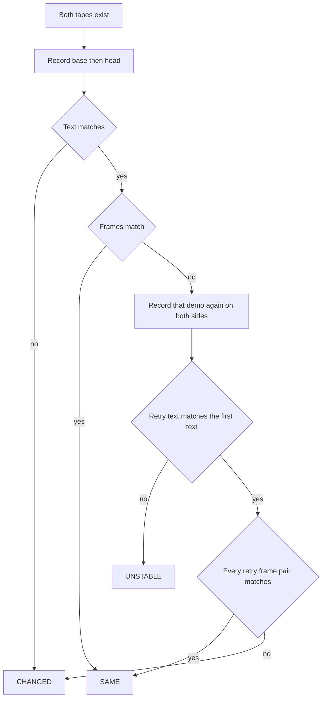

# Task: issue-190

* Task ID: issue-190
* Complexity: Level 3
* Type: feature

Demo pull-request comments expand every demo because GIF bytes are compared, and VHS never writes the same GIF twice. This build records the merge-base and the pull-request head in one job, fingerprints each demo from the text record and the frame-text PNG sequence, and reports those verdicts in shadow. Today's expand/collapse and today's release-please GIF amend stay as they are until real pull requests show that a dependency bump comes out SAME.

## Pinned Info

### Frame verdict

A text mismatch is final. A frame mismatch counts only when the re-recording still disagrees. One agreeing pair does not cancel a retry that still disagrees.

```mermaid
flowchart TD
  both[Both tapes exist]
  record[Record base then head]
  textMatch{Text matches}
  changed[CHANGED]
  frameMatch{Frames match}
  same[SAME]
  retry[Record that demo again on both sides]
  stable{Retry text matches the first text}
  unstable[UNSTABLE]
  retryMatch{Every retry frame pair matches}
  both --> record
  record --> textMatch
  textMatch -->|no| changed
  textMatch -->|yes| frameMatch
  frameMatch -->|yes| same
  frameMatch -->|no| retry
  retry --> stable
  stable -->|no| unstable
  stable -->|yes| retryMatch
  retryMatch -->|yes| same
  retryMatch -->|no| changed
```

## Component Analysis

### Affected Components

- `scripts/demo-fingerprint.ts` (new): pure fingerprint and verdict logic. No such module exists today.
- `scripts/demo-fingerprint.test.ts` (new): Vitest coverage for that logic.
- `scripts/generate-demo.js`: builds one image tagged `vhs-node-demo` and runs tapes with `--output` pointed at `docs/img`. Gains an image tag, a scratch directory, and a temporary tape that adds the text and frame `Output` lines.
- `demos/*.tape`: after `Enter` on `node examples/….js`, each tape sleeps 1s while hidden. That sleep becomes `Wait+Screen /Search:/`. The rendered prompt prefix is `Search:` (`src/index.ts`).
- `.github/workflows/generate-demos.yaml`: generates head GIFs, uploads them, and decides CHANGED by git-diffing those GIFs. Gains a merge-base worktree, a second image, scratch recordings, and a shadow verdict step.
- `.github/workflows/scripts/detect-demo-changes.sh`: git-diffs `docs/img/*-demo.gif`. Stays the source of today's expand/collapse and of the release-please amend decision.
- `.github/workflows/scripts/templates/demo-comment.md`: gains one shadow-verdict line. The `
` blocks stay driven by the GIF diff.
- `vitest.config.ts` and `tsconfig.test.json`: let the new script tests run and typecheck. Coverage include stays `src/**/*.ts`. Stryker mutate stays `src/**/*.ts`.

### Cross-Module Dependencies

- The workflow calls `generate-demo.js` twice, once per tree, then calls the fingerprint CLI on the two scratch trees.
- `generate-demo.js` calls the tape rewriter, then `docker run` with the scratch mount.
- The comment template reads `SHADOW_VERDICTS` from the workflow. It does not read the fingerprint module.
- Base and head images are both `FROM ghcr.io/charmbracelet/vhs:v0.10` via that tree's `demos/Dockerfile`. They are tagged `vhs-node-demo:base` and `vhs-node-demo:head` so the builds do not overwrite each other.
- Recordings of the two sides run one after the other, and demos inside a side run one at a time, so frame capture is not competing with itself on a 4-vCPU runner.

### Boundary Changes

- No package export, npm script contract, or published file changes. `npm run demo:generate*` without the new flags still writes only the GIF.
- The pull-request comment gains one shadow line. Which `
` blocks are open does not change.
- Release-please still amends GIF bytes whenever the old detector says they differ.

### Invariants and Constraints

- Feature pull requests get no bot commits.
- Frame hashes are never committed and never uploaded. Scratch stays off `docs/img/*.gif`.
- A text mismatch is CHANGED on the first comparison.
- A frame mismatch is CHANGED when a retry pair also mismatches. SAME when the first frames differ and every retry pair matches.
- A retry whose text differs from the first recording of that same side is UNSTABLE. Shadow prints it and exits 0, so the required check stays green.
- Head is `pull_request.head.sha`. Base is `git merge-base` of that SHA and the PR base. The synthetic merge commit is not the head recording.
- A pull request that changes `demos/Dockerfile` or the VHS version reads as CHANGED for every demo that still has a tape.
- Durations are not compared.
- This build does not switch the comment and does not gate release-please GIF commits on the new verdict. Those wait until shadow shows dependency bumps as SAME. The verdict vocabulary is the contract that follow-up consumes.

## Open Questions

None. The issue specifies the fingerprints, the same-job recording, and shadow mode. The operator's retry amendment on 2026-10-08 replaces the issue's "SAME if any pair matches" rule. The comment switch is sequenced after shadow by the issue's rollout, and this session cannot produce the week of pull requests that rollout asks for.

## Test Plan (TDD)

### Behaviors to Verify

- Text record with setup frames that are only `>` or whitespace, then repeated screens → those setup frames are dropped and consecutive duplicates collapse to one.
- Two different validation lines → normalized text differs.
- Same screens written with a different number of held duplicates → normalized text matches.
- Frame paths in filename order, with consecutive identical PNG bytes → fingerprint hashes each file, keeps 16 hex chars, collapses consecutive repeats, then hashes that sequence.
- Same frames with a different run of duplicates → same fingerprint.
- One PNG byte different → different fingerprint.
- Empty frame list → a defined fingerprint, equal to another empty list.
- Tape only on the head → NEW. Tape only on the base → REMOVED.
- Both tapes, text differs on the first attempt → CHANGED, and a later frame match does not override it.
- Both tapes, text matches, frames match → SAME. No retry signal.
- Both tapes, text matches, frames differ, no retry supplied → NEED_FRAME_RETRY.
- Retry text on one side differs from that side's first text → UNSTABLE.
- First frames differ, the only retry's frames match, retry text matches the first text → SAME.
- First frames differ, a retry's frames also differ → CHANGED.
- Two retries, the first retry matches and the second differs → CHANGED.
- Temporary tape copy → original bytes untouched; appended `Output` lines use quoted absolute paths for the text file and the frames directory.
- Docker argv when scratch is set → image tag, scratch mount, gif mount, in-container tape path, gif `--output`. Without scratch → today's gif-only command.

### Edge Cases

- Text record that is empty after normalization matches another empty record.
- A missing text file or an unreadable frame is an error from the reader, not a SAME.
- Demo names that are not a single path segment are rejected.
- `Wait+Screen /Search:/` replaces only the hidden sleep after `node examples/….js`. The later `Sleep` lines stay.

### Test Infrastructure

- Framework: Vitest, `npm test` and `npx vitest run -t "TEST_NAME"`.
- Test location: `scripts/demo-fingerprint.test.ts`.
- Conventions: behavior names, `src/**/*.test.ts` today. This file is the first test outside `src/`.
- New test files: `scripts/demo-fingerprint.test.ts`.
- `vitest.config.ts` `include` adds `scripts/**/*.test.ts`. Coverage `include` stays `src/**/*.ts`.
- `tsconfig.test.json` `include` adds the script module and its test so ESLint's type-aware project can see them.
- No test infrastructure exists for bash or for GitHub Actions. The workflow step is glue over the tested CLI. No new runner.

### Integration Tests

- None in Vitest. Docker is not installed on this machine, and a tape-content assertion would go red only when the tape is edited. The workflow's shadow line on a real pull request is the integration observation.

## Implementation Plan

### 1. Text normalization — executable

- Files: `scripts/demo-fingerprint.ts`, `scripts/demo-fingerprint.test.ts`, `vitest.config.ts`, `tsconfig.test.json`

1. Stub tests: empty cases for dropping bare-prompt frames, collapsing consecutive screens, and keeping a one-character text change.
2. Stub interface: `normalizeTextRecord(text: string): string`.
3. Write tests and run red: the issue's separator is `─` repeated 80 times; drop frames matching `/^[>\s]*$/`; collapse consecutive identical frames; join the kept frames with that separator.
4. Write code and run green: implement that function. Register the test file with Vitest and `tsconfig.test.json`.

### 2. Frame-state fingerprint — executable

- Files: `scripts/demo-fingerprint.ts`, `scripts/demo-fingerprint.test.ts`

1. Stub tests: empty cases for duplicate collapse, byte sensitivity, and the empty list.
2. Stub interface: `frameStateFingerprint(framePaths: readonly string[]): string`.
3. Write tests and run red: paths are hashed in the given order with SHA-256, truncated to 16 hex chars, consecutive repeats removed, then the remaining lines hashed. Tests write tiny distinct files in a temp directory.
4. Write code and run green: implement with `node:crypto`. No new dependency.

### 3. Verdict — executable

- Files: `scripts/demo-fingerprint.ts`, `scripts/demo-fingerprint.test.ts`

1. Stub tests: empty cases for NEW, REMOVED, CHANGED, SAME, NEED_FRAME_RETRY, and UNSTABLE, including the two-retry case where a later mismatch wins.
2. Stub interface: `assessFingerprints(input: AssessmentInput): Assessment`. `Assessment` is `NEW`, `REMOVED`, `CHANGED`, `SAME`, `UNSTABLE`, or `NEED_FRAME_RETRY`. Input carries whether each tape exists and the attempts. Each attempt has normalized text and a frame fingerprint per side, or records that the side was not recorded.
3. Write tests and run red: assert the pinned flowchart, including "a matching retry does not erase a later differing retry" and "a text mismatch is not retried into SAME".
4. Write code and run green: implement `assessFingerprints`. Add `formatShadowLine(entries: { name: string, assessment: Assessment }[]): string` and test its single-line shape.

### 4. Tape output injection and docker argv — executable

- Files: `scripts/demo-fingerprint.ts`, `scripts/demo-fingerprint.test.ts`, `scripts/generate-demo.js`

1. Stub tests: empty cases for the temporary tape and for `buildDockerRunArgs`.
2. Stub interface: `withFingerprintOutputs(tapeSource: string, textPath: string, framesDir: string): string` and `buildDockerRunArgs(options): string[]`.
3. Write tests and run red: the source string is unchanged; the result appends quoted absolute `Output` lines; args include the image, both mounts, the scratch tape path, and the gif `--output`. Without a scratch directory the args match today's gif-only invocation.
4. Write code and run green: implement the helpers. `generate-demo.js` accepts `--image`, `--scratch`, and `--gif-dir`. When scratch is set it writes the temporary tape under the scratch mount, mounts scratch and the gif directory, and runs demos one at a time. When scratch is omitted, behavior stays as it is now.

### 5. Harden the tapes — executable

- Files: `demos/basic.tape`, `demos/validation.tape`, `demos/custom-theme.tape`
- No tests: a test that asserts the tape source goes red only when that source is edited. The hidden `Sleep 1s` after `node examples/….js` becomes `Wait+Screen /Search:/`. Every later `Sleep` stays.

### 6. Shadow workflow — prose/policy

- Files: `.github/workflows/generate-demos.yaml`, `.github/workflows/scripts/templates/demo-comment.md`
- No tests: prose/policy artifact. The executable decision is the CLI from steps 1–4. This step only invokes it.
- Creative ref: none

1. After checkout, resolve head as `github.event.pull_request.head.sha` and base as the merge-base of that SHA and the PR base ref. On `workflow_dispatch`, use `HEAD` and `origin/main`.
2. `git worktree add --detach` the base. Build `vhs-node-demo:base` from the worktree and `vhs-node-demo:head` from the PR head tree, each with that tree's `demos/Dockerfile`.
3. Record base into the scratch tree, then head. Head GIFs still land in `docs/img` for the existing upload. Base GIFs, all text records, and all frames stay in scratch.
4. Run the fingerprint CLI. For each `NEED_FRAME_RETRY` demo, record that demo again on both sides into a second scratch directory, then assess again.
5. Append the shadow line to `$GITHUB_STEP_SUMMARY` and pass it to the comment as `SHADOW_VERDICTS`. Add one line to the comment template. Do not change `detect-demo-changes.sh`, the `
` logic, or the release-please amend condition.
6. Leave the worktree and scratch on the runner. Do not upload scratch. Do not commit verdicts.

### 7. Docs pointer — prose/policy

- Files: none under `memory-bank/` persistent docs. `techContext.md` still describes GIF regeneration, which remains what the comment and the release amend do.
- No tests: prose/policy artifact

1. Put the shadow explanation in the workflow step name and the comment line, so a reviewer can see the verdicts without a README change that would describe behavior the comment does not have yet.

## Technology Validation

No new technology - validation not required. Fingerprints use `node:crypto`. VHS stays the v0.10 image already pinned in `demos/Dockerfile`. ffmpeg is already in that image and is unused until a later change builds the stacked before/after GIF.

## Challenges and Mitigations

- A busy runner skips a short frame: record sides serially at parallelism 1, then apply the frame retry. Text does not depend on that sampler.
- The same commit's text differs across attempts: report UNSTABLE, exit 0, and do not call the demo SAME.
- Recording the merge commit would blame later `main` commits on an unrelated pull request: record `pull_request.head.sha` against the merge-base.
- Two Docker builds share one tag: use `:base` and `:head`.
- Scratch PNGs get uploaded or committed: artifact path stays `docs/img/*.gif`. Release amend stays `git add docs/img/*.gif`.
- `Wait+Screen` times out because the prompt prefix changed: the pattern is the literal `Search:` prefix in `src/index.ts`. A prefix change is a real demo change and will also fail the recording, which is the right failure.
- This machine has no Docker: build verification is Vitest plus `npm run quality:check`. The first shadow observation is CI.
- Expanding Vitest's include pulls script files into the coverage gate: coverage `include` stays `src/**/*.ts`.

## Pre-Mortem

- The visible comment still marks every demo CHANGED, so the pull request that merges this looks like the old bug. That is the shadow rollout. The plan's job-summary line is the evidence. Switching the `
` blocks in this build would skip the evidence the issue requires.
- Head recorded from the wrong SHA makes dependency-bump pull requests look CHANGED and the shadow week "fails" a working detector. Step 6 pins the head SHA and the merge-base.
- The frame retry is implemented as "SAME if any pair matches", which the operator rejected. Step 3's two-retry test locks the opposite rule before the workflow exists.
- CI text is unstable and we treat that as ordinary CHANGED noise. UNSTABLE is a separate assessment so a self-disagreement cannot be read as a demo change.

## Status

- [x] Component analysis complete
- [x] Open questions resolved
- [x] Test planning complete (TDD)
- [x] Implementation plan complete
- [x] Technology validation complete
- [x] Pre-Mortem complete
- [ ] Preflight
- [ ] Build
- [ ] QA
